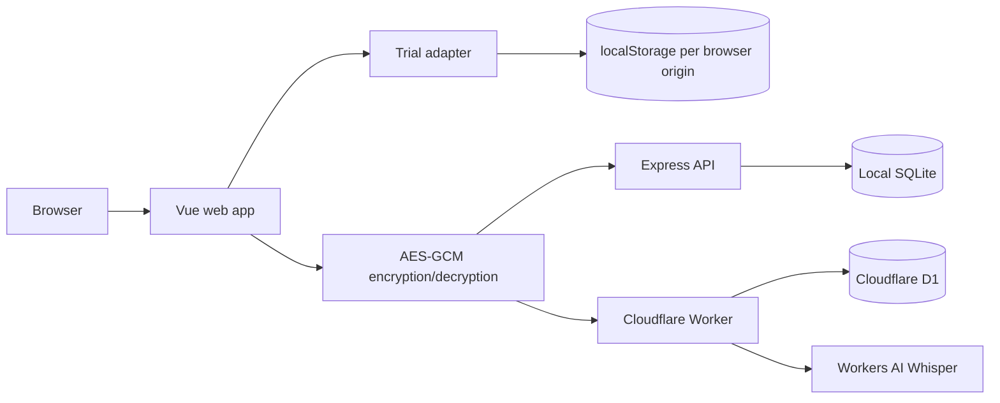

# Architecture

Fragments has one Vue frontend with two persistence modes. The trial is fully
offline; premium uses the existing authenticated server path.

## Runtime modes

`VITE_TRIAL_MODE=true` selects the local adapter. It requires no session, API or
network request. Its versioned `fragments-trial-v1` store is grouped by date,
seeded once with welcome fragments, and updated after every create, edit or
delete. Data is isolated by browser origin, so localhost and GitHub Pages do not
share it. Clearing site data deletes the trial data.

Without trial mode, the frontend uses the authenticated API adapter. The local
premium command calls Express and SQLite; the deployed premium build calls the
same-origin Worker and D1. Both server runtimes share the asynchronous use cases
and repository contracts.

Premium note titles and contents are encrypted in the browser before persistence.
The encryption key is derived from the user's password and remains in browser
memory. Voice uploads are a premium-only exception: the Worker sends temporary
audio to Workers AI, discards the audio and stores the resulting text fragment.

## Authentication

Premium login uses server-side sessions represented by 30-day HttpOnly cookies.
The Worker accepts an optional `SIGNUP_INVITE_CODE` secret. When configured, the
signup endpoint requires a matching `inviteCode`; login is unaffected. Omitting
the secret restores public signup without changing the API shape.

## Repository structure

| Area | Responsibility |
| --- | --- |
| `apps/web` | Vue UI, trial storage, premium API client and encryption. |
| `apps/api` | Local Express routes and SQLite adapter. |
| `apps/worker` | Cloudflare Worker, D1 adapter, AI binding and migrations. |
| `packages/server-core` | Shared application functions and persistence contracts. |
| `packages/shared` | Browser/API TypeScript types. |

## Testing strategy

API tests cover premium HTTP behaviour, authentication, ownership, validation
and voice handling. Type checks and builds cover both frontend modes and the
Worker bundle. The GitHub Pages build is static and must not depend on `/api`,
`/auth` or `/fragments` requests.
