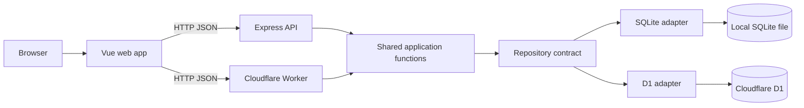

# Architecture

Fragments is a small npm-workspaces monorepo. The browser can call either the
local Express runtime or the Cloudflare Worker runtime. Both runtimes share the
same asynchronous application functions and repository contracts, while their
database adapters remain separate.

## Repository structure

| Area | Responsibility |
| --- | --- |
| `apps/web` | Reading and writing UI, date navigation, API client. |
| `packages/server-core` | Async application functions and repository contracts shared by both runtimes. |
| `apps/api/src/presentation` | Local Express routes, DTO validation, status codes, error translation. |
| `apps/api/src/infrastructure` | Local SQLite connection, migrations and prepared SQL statements. |
| `apps/worker` | Cloudflare Worker entrypoint, D1 adapter, Wrangler config and migrations. |
| `packages/shared` | Types exchanged by the browser and API. |

This is a pragmatic separation, not a framework. The application functions depend
on a minimal repository interface because it makes the storage boundary explicit;
no generic repository framework or dependency-injection container is introduced.

## Request flow

When a person saves a fragment, `FragmentComposer.vue` calls `api.ts`. The local
Express route or the Worker route validates JSON with Zod. `createFragment`
normalises the optional title, assigns an ID and timestamps, then asks the selected
repository adapter to insert it. The created fragment returns as JSON with HTTP 201
and the Vue page reloads the selected day's chronological list.

`GET /fragments?date=YYYY-MM-DD` filters on the ISO creation date and sorts ascending. ISO timestamps make the current ordering unambiguous. The browser selects dates in its local timezone; the current MVP stores timestamps in UTC, so entries made around midnight may appear under their UTC day. This is a known product decision to revisit once timezone semantics are specified.

Voice capture uses `MediaRecorder` and sends a bounded `multipart/form-data` upload
to `POST /fragments/voice`. The Worker validates the authenticated request, sends the
in-memory audio bytes to Workers AI Whisper, and persists only the returned text as a
`voice` fragment. The local Express route accepts an injected transcriber for tests;
the default local runtime reports that voice transcription is unavailable because it
does not have a Workers AI binding.

## API

| Method | Path | Result |
| --- | --- | --- |
| `POST` | `/fragments` | Creates a text fragment (201). |
| `GET` | `/fragments?date=YYYY-MM-DD` | Returns that day's fragments in chronological order. |
| `GET` | `/fragments/:id` | Returns one fragment or 404. |
| `PATCH` | `/fragments/:id` | Edits title and/or content. |
| `DELETE` | `/fragments/:id` | Removes it (204). |
| `POST` | `/fragments/voice` | Transcribes a temporary audio upload into a voice fragment (201). |

Malformed request data receives 400, missing fragments receive 404, and unexpected failures receive 500. Titles are optional, content is required and limited to 20,000 characters.

## Persistence

The versioned schema includes `users`, `sessions` and `fragments`; `fragments.user_id`
is nullable until the authentication iteration assigns ownership. `source` supports
both text and voice fragments. Voice uploads are transcribed in memory and the
original audio is discarded. Local migrations are applied through
`apps/api/src/infrastructure/sqlite-migrations.ts`. D1 migrations live in
`apps/worker/migrations` and are applied with Wrangler. Local data is not implicitly
copied to D1; migration is an explicit export/import operation.

## External dependencies

Vue and Vite provide the browser UI. Express exposes the local API. The Worker
exposes the remote API and serves the built assets. Zod owns API boundary
validation. `better-sqlite3` provides local synchronous prepared statements, while
D1 provides asynchronous prepared statements through `env.DB`. Both adapters
implement the same async repository contract.

## Testing strategy

The API tests exercise useful vertical behaviours through HTTP: creation plus date retrieval, input validation, and not-found handling. This gives confidence across validation, application logic, and the real SQLite queries without chasing a coverage target. UI visual and interaction tests can be added when its behaviour becomes more complex.
