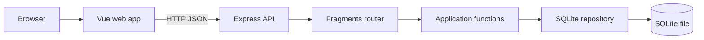

# Architecture

Fragments is a small npm-workspaces monorepo. It deliberately keeps the first vertical slice close to the product: a Vue page calls an Express API, which validates input, runs small application functions, and persists fragments in SQLite.

## Repository structure

| Area | Responsibility |
| --- | --- |
| `apps/web` | Reading and writing UI, date navigation, API client. |
| `apps/api/src/presentation` | HTTP routes, DTO validation, status codes, error translation. |
| `apps/api/src/application` | Create, read, update and delete use cases. |
| `apps/api/src/domain` | The persisted fragment shape and the small storage contract. |
| `apps/api/src/infrastructure` | SQLite schema and prepared SQL statements. |
| `packages/shared` | Types exchanged by the browser and API. |

This is a pragmatic separation, not a framework. The API has one domain object and one storage mechanism, so each layer remains a small file. The application functions depend on a minimal repository interface because it makes their storage boundary explicit; no generic repository framework or dependency-injection container is introduced.

## Request flow

When a person saves a fragment, `FragmentComposer.vue` calls `api.ts`. Express parses JSON and `fragments-router.ts` validates it with Zod. `createFragment` normalises the optional title, assigns an ID and timestamps, then asks the SQLite repository to insert it. The created fragment returns as JSON with HTTP 201 and the Vue page reloads the selected day's chronological list.

`GET /fragments?date=YYYY-MM-DD` filters on the ISO creation date and sorts ascending. ISO timestamps make the current ordering unambiguous. The browser selects dates in its local timezone; the current MVP stores timestamps in UTC, so entries made around midnight may appear under their UTC day. This is a known product decision to revisit once timezone semantics are specified.

## API

| Method | Path | Result |
| --- | --- | --- |
| `POST` | `/fragments` | Creates a text fragment (201). |
| `GET` | `/fragments?date=YYYY-MM-DD` | Returns that day's fragments in chronological order. |
| `GET` | `/fragments/:id` | Returns one fragment or 404. |
| `PATCH` | `/fragments/:id` | Edits title and/or content. |
| `DELETE` | `/fragments/:id` | Removes it (204). |

Malformed request data receives 400, missing fragments receive 404, and unexpected failures receive 500. Titles are optional, content is required and limited to 20,000 characters.

## Persistence

The single `fragments` table stores an opaque UUID, nullable title, content, source, and ISO timestamps. `source` is constrained to `text`; voice is deliberately outside this MVP. The API creates the schema and an index for chronological lookups at startup. Data is in `apps/api/data/fragments.sqlite` and survives process restarts.

## External dependencies

Vue and Vite provide the browser UI. Express exposes the API. Zod owns the API boundary validation. `better-sqlite3` provides synchronous, prepared SQLite statements. This is appropriate for a small, local MVP; a future hosted, multi-user version should reassess the database connection and concurrency model.

## Testing strategy

The API tests exercise useful vertical behaviours through HTTP: creation plus date retrieval, input validation, and not-found handling. This gives confidence across validation, application logic, and the real SQLite queries without chasing a coverage target. UI visual and interaction tests can be added when its behaviour becomes more complex.
